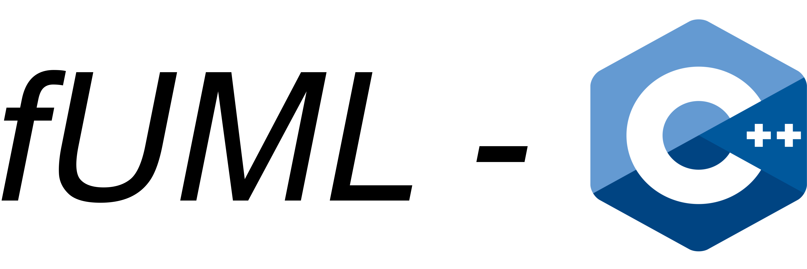

# fUML Reference Implementation for *C++*
This software is an open source reference implementation of the *Semantics of a Foundational Subset for Executable UML Models* (fUML)
specification by the *Object Management Group* (OMG) (see [here](https://www.omg.org/spec/FUML/1.5/About-FUML)). This implementation is based on the Java fUML reference implementation developed by
*Model Driven Solutions* (see [https://github.com/ModelDriven/fUML-Reference-Implementation](https://github.com/ModelDriven/fUML-Reference-Implementation))

## Licensing
For licensing information, please see the [LICENSE.md](https://github.com/HammerMaximilian/fUML-CPP/blob/master/LICENSE) file.

## Prerequisites
For detailed information, please see the [User Guide](fUML-C++_User_Guide.pdf) section *1. Prerequisites*.
### 1. Required Software
* Compiler: *GCC* (Linux) or *MinGW-w64* (Windows)
* *Java Runtime Environment*
* *Eclipse CDT* or any Eclipse IDE with *C++-Development Tools* installed
### 2. Recommended but optional Software
* *Eclipse Modeling Tools* for creating UML models
* *Eclipse Papyrus* for more sophisticated and graphical modeling of UML models
* *Acceleo* to be able to use the code generator for executable models

## Setup
For detailed information, please see the [User Guide](fUML-C++_User_Guide.pdf) section *2. Setup*.
### 1. Setting up Eclipse
* Import fUML-C++ root project *fUML-CPP* into your workspace
* Import nested projects *uml* and *fuml*
### 2. Environment Variables
* Add binary directories paths of *uml* and *fuml* to your system's environment variables (e.g. add them to PATH in Windows)
* Depending on whether you want to build debug version, release version or both versions of the dynamic libraries:
  * `%fUML-C++_root%\uml\Debug` for debug version of uml
  * `%fUML-C++_root%\uml\Release` for release version of uml
  * `%fUML-C++_root%\fuml\Debug` for debug version of fuml
  * `%fUML-C++_root%\fuml\Release` for release version of fuml

## Building
For detailed information, please see the [User Guide](fUML-C++_User_Guide.pdf) section *3. Build*.
* Build dynamic libraries for *uml* and *fuml* (**in that order**) using Eclipse C++-Development Tools managed build
* Depending on your preferences and needs, build debug, release or both

## Usage
For detailed information, please see the [User Guide](fUML-C++_User_Guide.pdf) section *4. Usage*.
### 1. Creating executable models using source code
### 2. Generating executable models from *.uml* models
